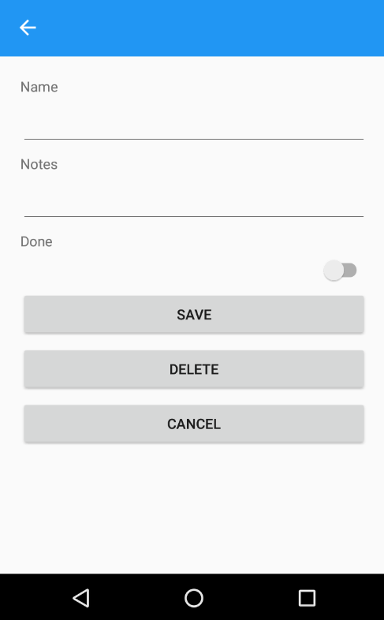

# Xamarin.Forms App using Entity Framework Core

Sample to show how to use **Entity Framework** Core 2.0 with **Xamarin.Forms**.

 

## Requirements

* Visual Studio 2017 15.3.0 or higher
* .NET Core 2.0

## Setup

**Download** or clone the repository. This is a solution with four projects.

**Rebuild** the solution to get all neccesary **NuGet** packages.

Enjoy!

## Clean and Rebuild

If you see build issues when pulling updates from the repo, try cleaning and rebuilding the solution.

## Copyright and license

Code released under the [MIT license](https://opensource.org/licenses/MIT).